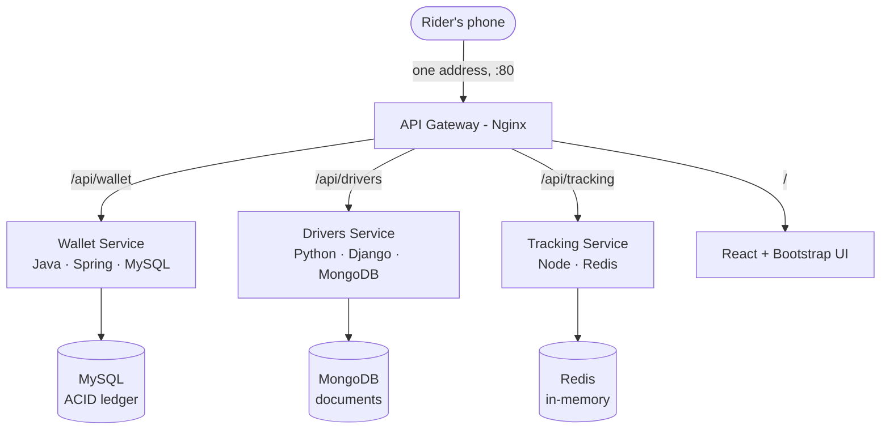

# mini-Careem — A Microservices Teaching Project

A tiny ride-hailing app, built the way Careem rebuilt itself: as a **fleet of
small services**, each owning its own data, its own stack, and its own fate.
This repository is the hands-on companion to the *"Microservices: a
philosophically different way of solving modern software problems"* talk.

The point of the demo is a single idea from the talk:

> **A shared database is a shared fate.** Real microservices each own their
> store. So this system runs **three services on three completely different
> stacks and three completely different databases** — and each choice is forced
> by the shape of its data, not by fashion.

---

## The big picture


<details>
<summary>Text version (mermaid)</summary>



</details>

Clients see **one address**. The gateway routes by URL path to the right
service. No service knows the others' databases exist; they talk only through
APIs.

---

## The three services, and why each stack is the *only* sane choice

| Service    | Owns              | Stack                          | Store    | Why                                                                                 |
|------------|-------------------|--------------------------------|----------|-------------------------------------------------------------------------------------|
| **Wallet** | money / fares     | Java · Spring Boot             | MySQL    | Money needs ACID transactions and a double-entry ledger. Boring, battle-tested, relational. |
| **Drivers**| driver profiles   | Python · Django                | MongoDB  | A bike, a car and a rickshaw driver share almost no fields. Profiles are documents, not rows. |
| **Tracking**| live GPS location | JavaScript · Node + React      | Redis    | A GPS ping is stale in seconds. Persisting it wastes a database. Keep it in RAM with a TTL. |
| **Metadata**| fare rates, peak factor | JavaScript · Node + Express | Redis / Local DB | Needs extremely fast read access during traffic surges, hence Node.js + RAM cache fallback pattern. |

Each service is a self-contained project with its **own README** explaining its
design in depth:

- [`wallet-service/`](./wallet-service/README.md)
- [`drivers-service/`](./drivers-service/README.md)
- [`tracking-service/`](./tracking-service/README.md)

---

## One ride, three services, three stores

When a rider in Karachi taps **"Book ride"**, the request fans out across the
fleet, and each service touches only its own store:

1. **Tracking** (Redis) finds nearby drivers from the latest live pings.
2. **Drivers** (MongoDB) returns the matched driver's profile — vehicle, papers,
   rating.
3. **Wallet** (MySQL) moves the fare from the rider's wallet to the driver's, as
   one balanced, atomic double-entry transaction.

Three services, three databases, one ride — and no shared schema anywhere.

---

## Run the whole thing locally (one command)

You need **Docker** (with Compose). From the repository root:

```bash
docker compose up --build
```

This starts everything on one machine — all three services, their databases,
the React UI, and the gateway — and wires them together:

- App / UI:  <http://localhost:8080>
- Wallet API:   <http://localhost:8080/api/wallet/health>
- Drivers API:  <http://localhost:8080/api/drivers/health>
- Tracking API: <http://localhost:8080/api/tracking/health>

> This all-in-one compose is a **convenience for local demos only**. In
> production the services do *not* share a host — that would quietly recreate
> the monolith. See deployment below.

### Try it end to end

```bash
# create rider + driver wallets, fund the rider, pay a fare
curl -s -XPOST localhost:8080/api/wallet/wallets  -H 'Content-Type: application/json' -d '{"ownerRef":"rider-1"}'
curl -s -XPOST localhost:8080/api/wallet/wallets  -H 'Content-Type: application/json' -d '{"ownerRef":"driver-1"}'
curl -s -XPOST localhost:8080/api/wallet/wallets/1/deposit -H 'Content-Type: application/json' -d '{"amount":500}'
curl -s -XPOST localhost:8080/api/wallet/transfers -H 'Content-Type: application/json' -d '{"fromWalletId":1,"toWalletId":2,"amount":180}'

# register a driver (a document with vehicle-specific fields)
curl -s -XPOST localhost:8080/api/drivers/ -H 'Content-Type: application/json' \
  -d '{"name":"Sana","phone":"+92300...","license_number":"LIC-CAR-1","vehicle_type":"CAR","vehicle":{"make":"Toyota","seats":4,"ac":true}}'

# send a GPS ping, then watch it on the map at http://localhost:8080
curl -s -XPOST localhost:8080/api/tracking/pings -H 'Content-Type: application/json' \
  -d '{"driverId":"driver-1","lat":24.86,"lng":67.01}'
```

---

## Tests

Every service is unit-tested and each suite runs **without any external
database** (they use in-memory test doubles):

| Service   | Command (in the service dir)          | Framework                      | What it checks                                            |
|-----------|----------------------------------------|--------------------------------|-----------------------------------------------------------|
| Wallet    | `mvn test`                             | JUnit 5, Mockito, MockMvc, H2  | Ledger balances to zero, overdraft/validation, HTTP codes |
| Drivers   | `python manage.py test`                | Django test runner + mongomock | Flexible document profiles, validation, CRUD, 404s        |
| Tracking  | `cd server && npm test`                | Node built-in test runner      | TTL expiry, store ops, HTTP routing/validation            |
| Tracking UI | `cd client && npm test`              | Vitest + Testing Library       | Coordinate projection, live map rendering, error state    |

At the time of writing, the Drivers suite (9 tests) and the Tracking backend
suite (10 tests) were executed and pass; the Wallet suite is standard Spring
Boot testing runnable with Maven, and the Tracking UI suite runs with Vitest
once `npm install` has fetched its dev dependencies.

---

## Deploying to AWS Lightsail (the topology from the talk)

The golden rule: **each service and its database live together on their own VM,
and nowhere else.**

### Step 1 — Create three instances

Create three Lightsail instances (Ubuntu, Docker installed). They share a
**private network** out of the box.

| VM            | Runs                                   |
|---------------|----------------------------------------|
| `wallet-vm`   | Wallet service + its private MySQL      |
| `drivers-vm`  | Drivers service + its private MongoDB   |
| `tracking-vm` | Tracking service + Redis + React UI + **the gateway** |

### Step 2 — One composer per VM

Copy each service folder to its VM and bring it up. Each service has its own
`docker-compose.yml` that runs the service container **plus its own database**,
side by side:

```bash
# on wallet-vm
cd wallet-service && docker compose up -d --build
# on drivers-vm
cd drivers-service && docker compose up -d --build
# on tracking-vm
cd tracking-service && docker compose up -d --build
```

The entire deployment of a service is one command.

### Step 3 — The gateway across VMs

On `tracking-vm`, run Nginx (see [`gateway/`](./gateway/)) as the single public
front door. Edit [`gateway/nginx.conf`](./gateway/nginx.conf) and replace the
placeholder hosts with your instances' **private IPs**:

```nginx
upstream wallet   { server <wallet-vm private IP>:8081;  }
upstream drivers  { server <drivers-vm private IP>:8082; }
upstream tracking { server 127.0.0.1:8083;               }  # same VM
```

Only the gateway's **port 80** faces the internet. Every service port stays on
the private network. Point Lightsail's firewall accordingly.

---

## When you should *not* do any of this

Straight from the talk — microservices trade code complexity for operational
complexity. Prefer a monolith when: the team is small, the domain boundaries are
still unclear, you have no DevOps/monitoring yet, or you genuinely need strong
consistency everywhere. Careem's original monolith was the *right first choice*.
Reach for a fleet of services when scale and independent teams make that first
choice the bottleneck — not before.

---

## Repository layout

```
mini-careem/
├── docker-compose.yml        # all-in-one local stack (dev convenience)
├── GUIDE.md                  # you are here
├── gateway/                  # Nginx: the one front door (prod + local configs)
├── wallet-service/           # Java · Spring Boot · MySQL   (money)
├── drivers-service/          # Python · Django · MongoDB    (profiles)
└── tracking-service/
    ├── server/               # Node thin API over Redis     (live location)
    └── client/               # React + Bootstrap live map UI
```
